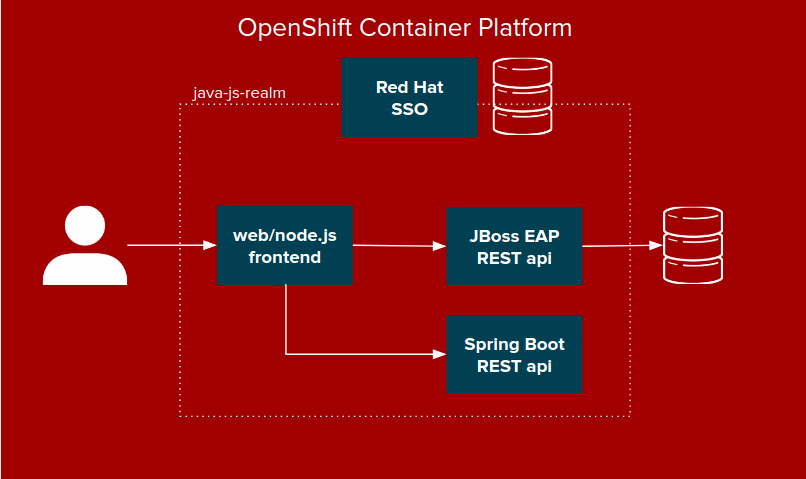
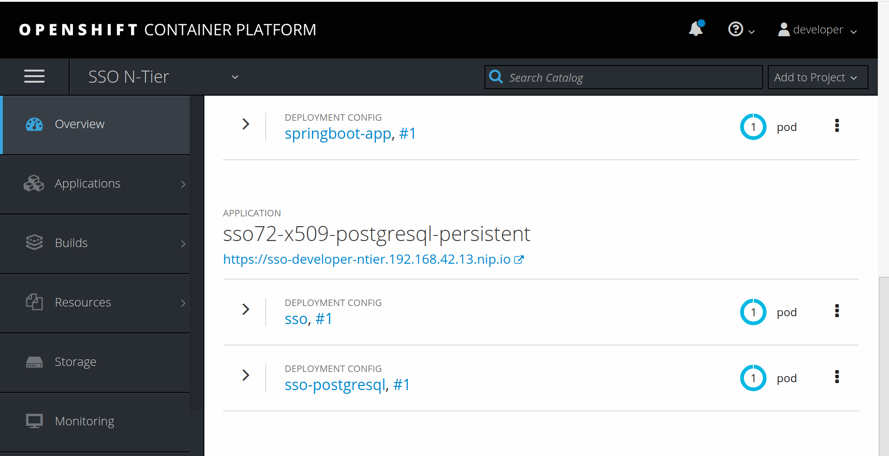
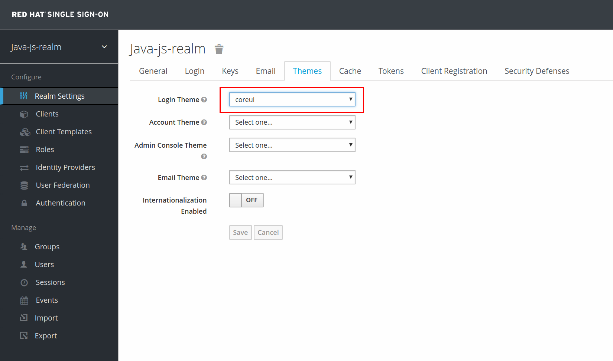
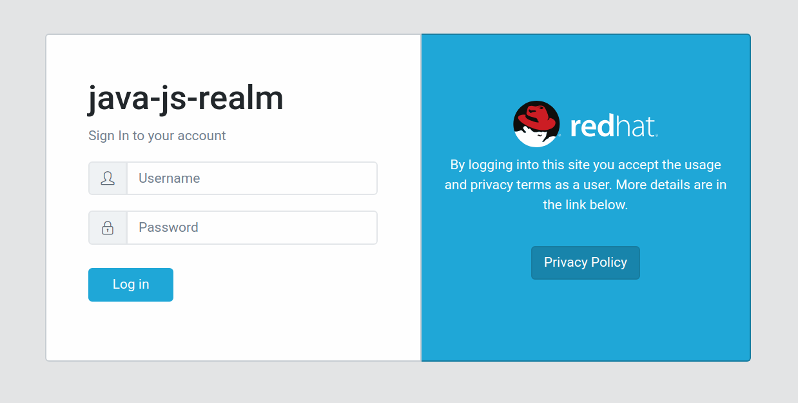
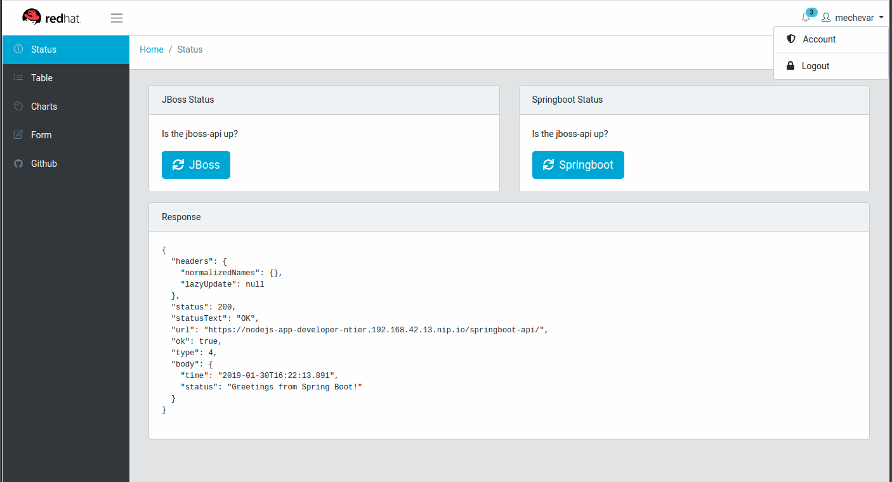

# Red Hat Openshift Single Sign-On Secured N-tier application

This project contains scripts and source to deploy a 3 tier application along with [Red Hat Single Sign-On](https://access.redhat.com/products/red-hat-single-sign-on) and secures the application with SSL.

The application has a [node.js](https://nodejs.org/en/) run [Angular](https://angular.io/) frontend (tier 1) that calls a 
[JBoss EAP](https://access.redhat.com/products/red-hat-jboss-enterprise-application-platform/) REST backend (tier 2) that persists data
to a [MySQL](https://www.mysql.com/) database (tier 3).
The Red Hat Single Sign-On deployment secures this deployed via a configured realm called **java-js-realm**.  The realm contains
configured clients for the public facing frontend (js) and the bearer only backend (eap). The security is simple and only checks that a **valid user is logged in**

All of the scripts to help deploy require that you are logged in via the [oc](https://docs.openshift.com/container-platform/3.10/cli_reference/get_started_cli.html) command line tool to 
a [Openshift](https://www.openshift.com/) cluster or [container development kit](https://developers.redhat.com/products/cdk/download/) instance

Example: `oc login -u developer`

## Deploy Red Hat Single Sign-On

In the `sso` folder, run the `ocp-deploy-sso.sh` script.  This script creates a custom build that includes a sample [theme](https://access.redhat.com/documentation/en-us/red_hat_single_sign-on/7.2/html/server_developer_guide/themes) for the login page, named `coreui`. Once finished you will see the deployed pods in the **SSO N-tier** project.
The login to the RH-SSO admin console is **admin/Redhat1!**

### Set the Public Key in the config map

Make sure the RH-SSO instance is up and running. Once the Red Hat Single Sign-on instance is up you will need to modify the [config map](https://docs.openshift.com/container-platform/3.10/dev_guide/configmaps.html) used
by the Springboot backend, JBoss EAP backend and nodejs frontend to communicate with Red Hat Single Sign-On.
`
* In the **RH-SSO admin console**, go to the **java-js-realm**, the **keys** tab and select **Public Key** and copy the value.

* In the **SSO N-Tier project**, go to **Resources** then **Config Maps**

* Edit the **ntier-config** and paste the value into the **PUBLIC_KEY** entry

## Deploy JBoss EAP and MySQL

In the `eap` folder run the `ocp-deploy-eap.sh` script.

## Deploy node.js

In the `node` folder run the `ocp-deploy-node.sh` script.

## Configure Clients

While the builds are running you can configure the clients in RH-SSO. 

### JS Client
* In the **java-js-realm**, select **clients**, then **create**
* Set **Client ID** to **js**, then select **save**
* Set **Valid Redirect URIs** to the route of your node.js instance plus **/***.  Example: `https://nodejs-app-ntier.192.168.42.24.nip.io/*`
  * In other words, in the Openshift Console overview for your project, copy the exposed route to the **nodejs-app**
* Set **Web Origins** to `*` 
* Select **save**

## Java Client
* In the **java-js-realm**, select **clients**, then **create**
* Set **Client ID** to **java**, then select **save**
* Set **Access Type** to **bearer-only**
* Select **save**
 
## Create User

* In the **java-js-realm**, select **Users**, then **Add User**
* Fill out the **Username**, **Email**, **First Name** and **Last Name** fields
* Select **save**
* On the **Credentials** tab, set a **new password**
* Select **Reset Password**
* Confirm that you want to **Change the password**

## Change Theme (optional)

* In the **java-js-realm**, select **Themes**
* Set the **Login Theme** value to **coreui**

## Test!

Now that everything is configured, go to the **node-js** application route and you should be prompted to login as the user you just created. You will also be prompted to create a new password. The screenshot below shows the themed login page.

You will be able to see your user attributes in the web application under the **Profile** tab.

Using the **Status** and **Cars** tabs will make REST calls to the JBoss EAP REST backend or Springboot backend. 

